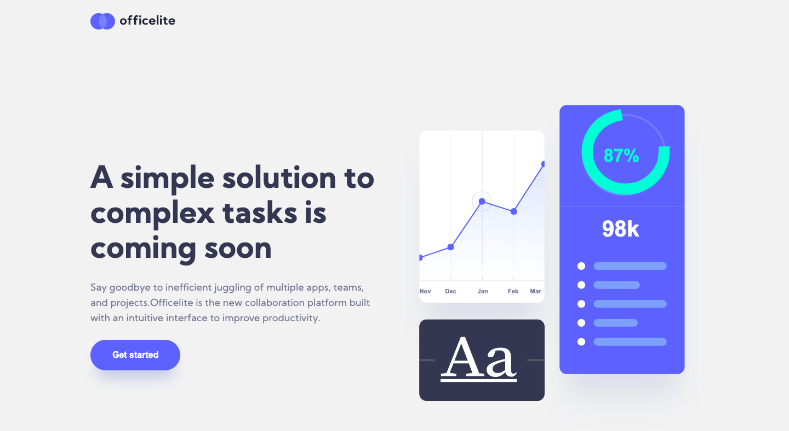

# Frontend Mentor - Officelite coming soon site solution

This is a solution to the [Officelite coming soon site challenge on Frontend Mentor](https://www.frontendmentor.io/challenges/officelite-coming-soon-site-M4DIPNz8g). Frontend Mentor challenges help you improve your coding skills by building realistic projects.

## Table of contents

- [Overview](#overview)
  - [The challenge](#the-challenge)
  - [Screenshot](#screenshot)
  - [Links](#links)
- [My process](#my-process)
  - [Built with](#built-with)
  - [What I learned](#what-i-learned)
  - [Continued development](#continued-development)
  - [Useful resources](#useful-resources)
- [Author](#author)
- [Acknowledgments](#acknowledgments)

## Overview

### The challenge

Users should be able to:

- View the optimal layout for the site depending on their device's screen size
- See hover states for all interactive elements on the page
- See error states when the contact form is submitted if:
  - The `Name` and/or `Email Address` fields are empty
  - The `Email Address` is not formatted correctly
- **Bonus**: See a live countdown timer that ticks down every second
- **Bonus**: See a custom-styled `select` form control in the sign-up form

### Screenshot



### Links

- Live Site URL: [Add live site URL here](https://hungry-edison-c89544.netlify.app/)

## My process

Start building small things fit for mobile screen,
then make them fit for lager screen.
After that, put small components together
and build layout from mobile size display.

### Built with

- Semantic HTML5 markup
- Flexbox
- CSS Grid
- Mobile-first workflow
- [React](https://reactjs.org/) - JS library
- [React Router DOM](https://reactrouter.com/web/guides/quick-start) - For Page link
- [Styled Components](https://styled-components.com/) - For styles
- [AOS](https://michalsnik.github.io/aos/) - For scrolling animation
- [React Transition Group](https://reactcommunity.org/react-transition-group/) - For custom dropdown animation
- [Joi](https://joi.dev/api/?v=17.4.0) - For input validation

**Note: These are just examples. Delete this note and replace the list above with your own choices**

### What I learned

I learned how much easier to implement UI with React.
At first, I tried to build custom down with Vanilla JS,
found out there're so much DOM manipulation and attention
to the connection between default select & option element and
custom appearance of dropdown made with div and span.

### Continued development

It was the first time for me to build
multi-background-pattern web site.
The approach I took was to build the whole contents expect
background, then encapsulate them in the element.
I'm appreciate if there are any good approaches to
build multicolor background.

```html
<Container style={{ height: "total height of <Contents wrapper>" }}>
  <Background /> // contains upper BG and bottom BG
    // put the content onto Container which has background
  <ContentsWrapper
    style={{position: "absolute", top: "0", right: "0"}}
    >...contains whole content
  </ContentsWrapper>
</Container>
```

Finally, for signup page, I decided to give boolean attribute
"signup" to elements which have similar style between
homepage and signup page in order to make my code DRY,
but it resulted in repetitive use of "signup={signup}"
for elements, also I end up putting so much
"${props => props.signup ? signupStyle : homepageStyle}".

I could not find any good idea about this approach,
but I'm sure it's better than making new components.

## Author

- Website - [Yosuke Motosugi](https://www.yosukemotosugi.com)
- Frontend Mentor - [@josuke0227](https://www.frontendmentor.io/profile/josuke0227)
